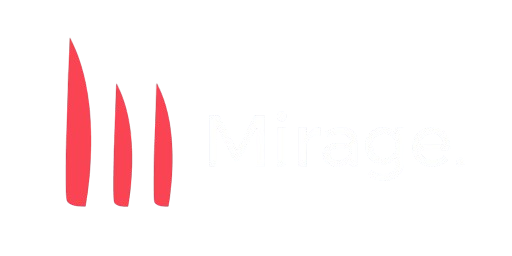

<p align="center">
  <a href="Assets/Wide/Transparent/wide.png">
    
  </a>
</p>

Mirage is a software project currently under active development.

> [!WARNING]
> Mirage is in an early stage of development. APIs, architecture, features, and project structure are subject to change.

## Development

The active development of Mirage takes place on the `develop` branch.

If the default branch appears incomplete or empty, this is expected. The latest development work can be found in `develop`.

```bash
git checkout develop
```

## Status

Mirage is currently experimental and should not be considered stable or production-ready.

This README is temporary and will be expanded as the project progresses.

## License

Mirage is licensed under the [MIT License](LICENSE).
